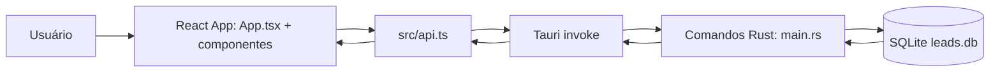
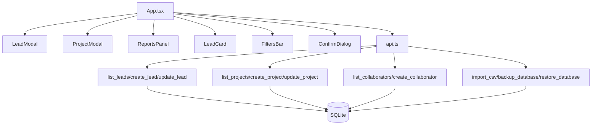

# 02: Arquitetura

## Introdução
A arquitetura do LeadFlow é local-first, em camadas, com frontend React e backend embutido em Tauri/Rust. Não há API HTTP externa no fluxo principal.

## Onde isso está no código
- Entrada do frontend: `src/main.tsx`.
- Orquestração de estado e telas: `src/App.tsx`.
- Contratos de chamada ao backend: `src/api.ts`.
- Comandos, regras e banco: `src-tauri/src/main.rs`.
- Configuração da app desktop: `src-tauri/tauri.conf.json`.

## Arquitetura em camadas
- Camada UI: componentes React, gráficos, modais e listas.
- Camada de serviço frontend: módulo `api` como gateway único para `invoke`.
- Bridge Tauri: serialização de payload e retorno entre TS e Rust.
- Camada de comandos Rust: handlers com validação, regra e SQL.
- Persistência: SQLite local em arquivo.

## Contratos entre camadas
- Frontend chama métodos de `api` com tipos `LeadPayload`, `ProjectPayload`, `CollaboratorPayload`.
- `api` traduz para comandos nomeados, por exemplo: `create_lead`, `list_projects`, `backup_database`.
- Rust recebe payload desserializado, valida dados, persiste e retorna entidades serializadas.
- Erros são propagados como `String`, capturados pelo frontend para feedback de interface.

## Padrões usados
- Command handlers: padrão principal no backend com `#[tauri::command]`.
- Service gateway no frontend: `api.ts` centraliza chamadas.
- Componentização UI: modais e painéis por responsabilidade.
- Migração incremental por código: `init_db` com `ensure_column` para evolução de schema sem framework externo de migration.

## Responsabilidades e cadeia de chamadas
- `App.tsx` coordena carregamento inicial e eventos de usuário.
- `LeadModal` e `ProjectModal` produzem payloads com validação de frontend.
- `api.ts` dispara `invoke` para comando correspondente.
- `main.rs` executa SQL e cálculos, retorna objeto final para atualização de estado.

## Diagrama de arquitetura

## Diagrama de componentes

## Como usar
- Para alterar contrato entre frontend e backend, editar em paralelo `src/types.ts`, `src/api.ts` e função Rust correspondente.
- Para adicionar recurso novo, manter o fluxo: tipo TS, método em `api`, comando em Rust, persistência SQL, UI consumidora.

## Exemplos
- Exemplo de extensão de comando: adicionar novo campo no lead exige mudança em tipo TS, payload Rust, SQL de insert/update e mapper `row_to_lead`.
- Exemplo de novo relatório: calcular no Rust em `get_dashboard_data` ou no frontend a partir de `projects`, dependendo da regra.
