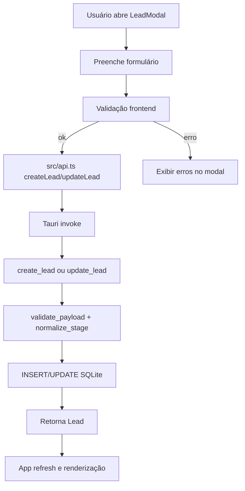
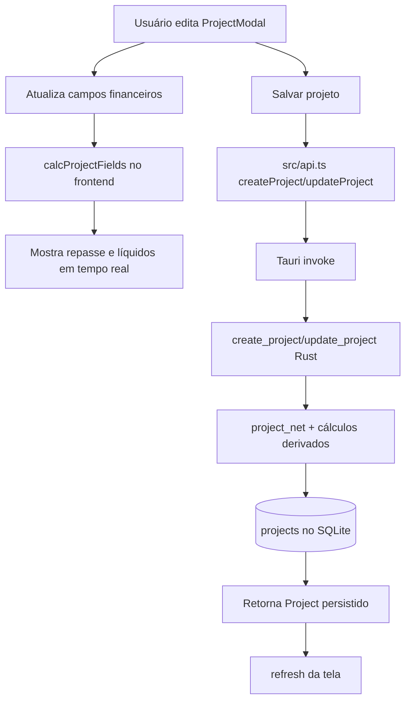
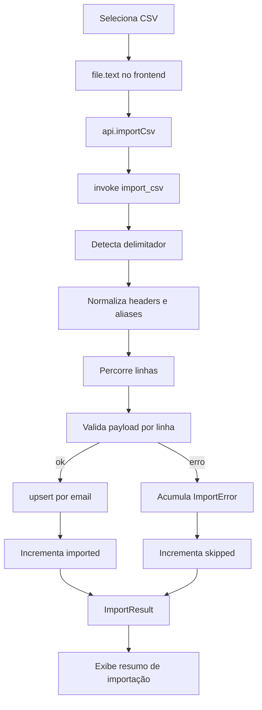
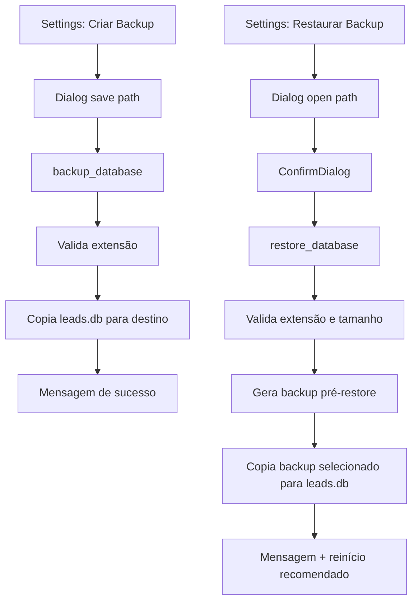
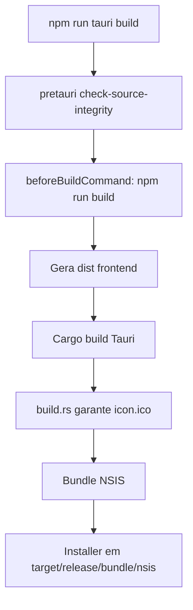

# 08: Fluxos e diagramas

## Introdução
Este documento centraliza os fluxos críticos de operação e manutenção do LeadFlow com diagramas Mermaid.

## Onde isso está no código
- Fluxos de leads e projetos: `src/App.tsx`, `src/components/LeadModal.tsx`, `src/components/ProjectModal.tsx`.
- Fluxos de persistência e cálculo: `src-tauri/src/main.rs`, `src/lib/projectFinance.ts`.
- Fluxos de import e backup/restore: `src/App.tsx`, `src-tauri/src/main.rs`.

## Fluxo de criação e edição de lead

## Fluxo de cálculo financeiro de projeto

## Fluxo de importação CSV

## Fluxo de backup e restore

## Fluxo de build e empacotamento Tauri

## Como usar
- Copiar os blocos Mermaid para visualizador Markdown compatível.
- Atualizar os diagramas sempre que comandos, entidades ou navegação mudarem.

## Exemplos
- Exemplo de revisão de bug: seguir diagrama de import CSV para isolar se falha está em parsing, validação ou persistência.
